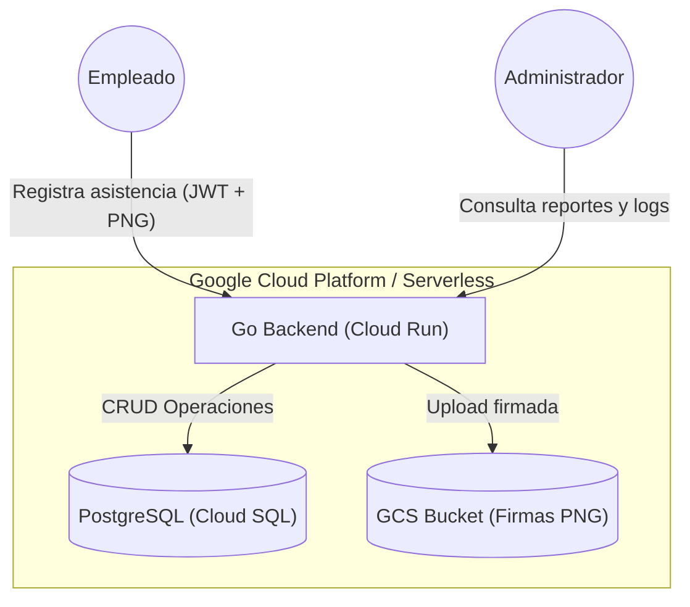
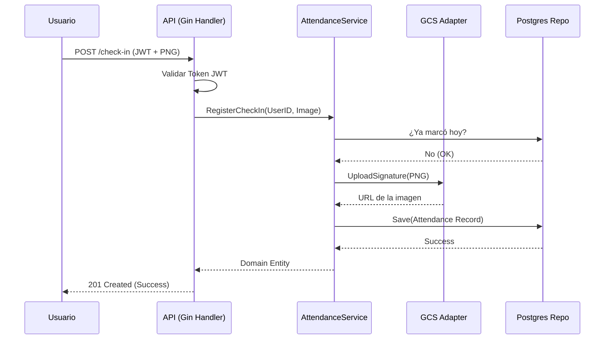
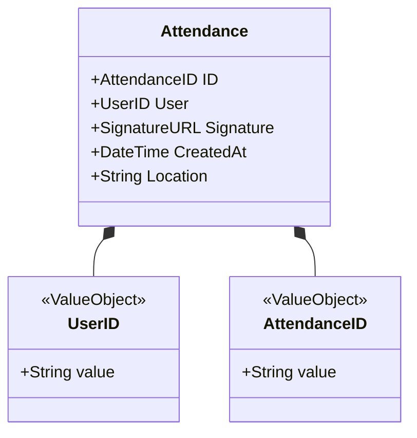
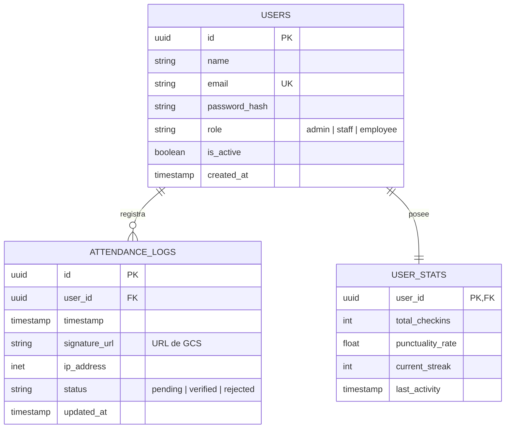

# 🏛️ Criton-API

Sistema de backend robusto para la **logística de asistencia** empresarial, utilizando firmas digitales (PNG) y arquitectura limpia.

## 🎯 Propósito del Proyecto

Este sistema reemplaza las planillas físicas de asistencia por un flujo digital auditable. El MVP está diseñado para manejar ~100 usuarios con una infraestructura serverless de bajo costo.

## 🏗️ Arquitectura del Sistema

### 1. Diagrama C4 (Contenedores)

Este diagrama muestra cómo interactúa el binario de Go con los servicios de Google Cloud y el cliente final.

### 2. Entidades

🛠️ Stack Tecnológico

    Lenguaje: Go 1.21+ (Fuerte énfasis en tipos y concurrencia).

    Framework: Gin Gonic para el ruteo HTTP.

    Arquitectura: Hexagonal (Ports & Adapters).

    Infraestructura: - Google Cloud Run (Compute)

        Google Cloud Storage (Firmas)

        PostgreSQL (Persistencia)

    Calidad: CI/CD con SonarQube "Zero Trust" quality gates.

🚀 Guía de Inicio Rápido
Requisitos

    Go instalado.

    Google Cloud SDK configurado.

    Instancia de Postgres (puedes usar el docker-compose.yml incluido).

Instalación

    Clonar el repo:
    Bash

    git clone [github.com/HanamDavid/criton-api](https://github.com/HanamDavid/criton-api)

    Instalar dependencias:
    Bash

    go mod tidy

    Configurar variables de entorno:
    Bash

    cp .env.example .env

📜 ADRs (Architecture Decision Records)

Las decisiones técnicas importantes están documentadas en docs/adr/:

    ADR-001: Arquitectura Hexagonal

---
